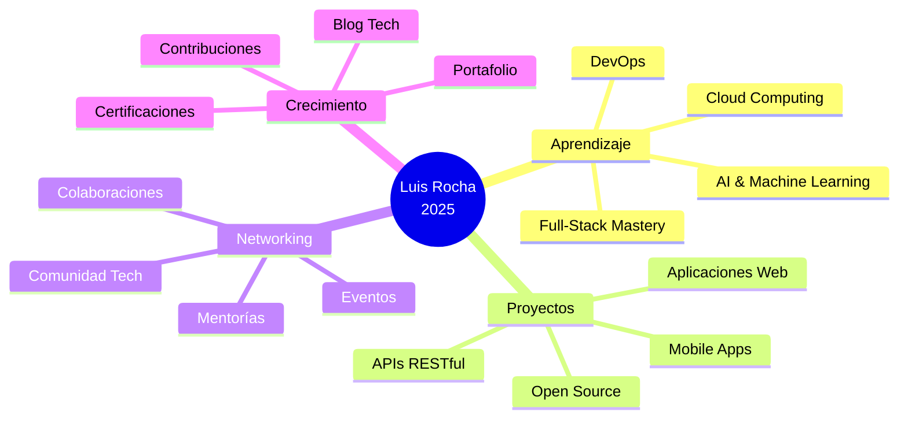

<h1 align="center">
  
</h1>

<div align="center">
  
</div>

<p align="center">
  
</p>

<p align="center">
  
  
</p>

---

## 🚀 Sobre Mí

```typescript
const luisRocha = {
    nombre: "Luis Rocha",
    username: "Luiss2080",
    ubicacion: "Santa Cruz, Bolivia 🇧🇴",
    educacion: {
        carrera: "Ingeniería en Sistemas",
        universidad: "Universidad Privada Domingo Savio",
        estado: "Estudiante Activo 📚"
    },
    edad: 20,
    pasiones: ["Tecnología", "Desarrollo", "Innovación", "Aprendizaje Continuo"],
    descripcion: "Apasionado por la tecnología y el desarrollo 🔥",
    objetivo: "Explorando y aprendiendo diferentes áreas del conocimiento digital ⭐",
    lema: "El conocimiento es poder, pero compartirlo es sabiduría 💡"
};
```


### 💫 Destacados

- 🎓 **Estudiante** de Ingeniería en Sistemas
- 🌱 Explorando **nuevas tecnologías** constantemente
- 💡 Apasionado por el **desarrollo web** y la **innovación**
- 🎯 Siempre buscando nuevos **desafíos**
- ⚡ **Fun fact**: Me encanta aprender algo nuevo cada día
- 🔭 Actualmente enfocado en **Full-Stack Development**
- 👨‍💻 Todos mis proyectos están disponibles en [GitHub](https://github.com/Luiss2080)

<br clear="right"/>

---

<h2 align="center">🛠️ Mi Tech Stack</h2>

<div align="center">
  
</div>

<br/>

<details open>
<summary><h3>💻 Lenguajes de Programación</h3></summary>
<br/>


</details>

<details open>
<summary><h3>🌐 Desarrollo Web & Frameworks</h3></summary>
<br/>


</details>

<details open>
<summary><h3>🗄️ Bases de Datos</h3></summary>
<br/>


</details>

<details open>
<summary><h3>🔧 Herramientas & Tecnologías</h3></summary>
<br/>


</details>

---

<h2 align="center">📊 Estadísticas de GitHub</h2>

<div align="center">
  
  
</div>

<div align="center">
  
  
</div>

<br/>

<div align="center">
  
</div>

<div align="center">
  
</div>

---

<h2 align="center">🏆 Logros de GitHub</h2>

<div align="center">
  
</div>

---

<h2 align="center">🌐 Conecta Conmigo</h2>

<p align="center">
  <a href="https://www.facebook.com/share/15EUCVYLMT/?mibextid=LQQJ4d">
    
  </a>
  <a href="https://www.instagram.com/luiss_990/profilecard/?igsh=MWZmbnpnMmV0OWt2OA==">
    
  </a>
  <a href="https://www.tiktok.com/@luisss_900?_t=8rtlCE8CtKa&_r=1">
    
  </a>
  <a href="https://www.linkedin.com/in/luis-rocha">
    
  </a>
  <a href="mailto:luisrocha@example.com">
    
  </a>
</p>

<div align="center">
  
</div>

---

<h2 align="center">💡 Quote del Día</h2>

<div align="center">
  
</div>

---

<h2 align="center">🎯 Objetivos 2025</h2>

<div align="center">



</div>

---

<h2 align="center">📈 Actividad de Codificación</h2>

```text
🌞 Mañana         ⣿⣿⣿⣿⣿⣿⣀⣀⣀⣀⣀⣀⣀⣀⣀⣀⣀⣀⣀⣀⣀   25%
🌆 Tarde          ⣿⣿⣿⣿⣿⣿⣿⣿⣿⣿⣿⣿⣀⣀⣀⣀⣀⣀⣀⣀⣀   45%
🌃 Noche          ⣿⣿⣿⣿⣿⣿⣀⣀⣀⣀⣀⣀⣀⣀⣀⣀⣀⣀⣀⣀⣀   20%
🌙 Madrugada      ⣿⣿⣀⣀⣀⣀⣀⣀⣀⣀⣀⣀⣀⣀⣀⣀⣀⣀⣀⣀⣀   10%
```

---

<h2 align="center">🎨 Proyectos Destacados</h2>

<div align="center">

[](https://github.com/Luiss2080/proyecto-destacado-1)
[](https://github.com/Luiss2080/proyecto-destacado-2)

</div>

---

<h2 align="center">🐍 Contribuciones</h2>

<div align="center">
  
</div>

---

<div align="center">
  
### 💭 Pensamiento del Desarrollador


</div>

---

<div align="center">

### 🎵 Actualmente Escuchando

[](https://spotify-github-profile.vercel.app/api/view?uid=31z5rz3c7yxjgv6q47huzepfwcim&redirect=true)

</div>

---

<div align="center">
  
### ⚡ Curiosidades Sobre Mí

| 🎯 Enfoque | 💻 Coding | 🌟 Aprendizaje | 🚀 Objetivos |
|:---:|:---:|:---:|:---:|
| Full-Stack Dev | JavaScript, Python | Siempre explorando | Innovación constante |
| 📚 Estudiante | 🎓 UPDS | 🇧🇴 Santa Cruz | ⭐ Apasionado |

</div>

---

<div align="center">

### 📫 ¿Cómo Contactarme?

**¡Estoy siempre abierto a nuevas oportunidades y colaboraciones!**

💼 Disponible para proyectos freelance  
🤝 Buscando colaboraciones en proyectos interesantes  
📧 Respondo rápido a mensajes  
☕ ¡Charlemos sobre tecnología!

</div>

---

<div align="center">
  
</div>

<div align="center">
  
### ⭐ Si te gustó mi perfil, ¡dale una estrella a mis repositorios! ⭐

**Hecho con ❤️ por Luis Rocha | Última actualización: 2025**


</div>
