<h1 align="center">
  
</h1>

  

<table align="center">
  <tr>
    <td width="50%" valign="top">
      

  
  

---

<h2 align="center">🛠️ Mi Tech Stack</h2>

  

<table width="100%">
  <tr>
    <td width="50%" valign="top">

---

<h2 align="center">📊 Estadísticas de GitHub</h2>

<table width="100%">
  <tr>
    <td width="50%" valign="top">
      
    </td>
    <td width="50%" valign="top">
      
    </td>
  </tr>
  <tr>
    <td width="50%" valign="top">
      
    </td>
    <td width="50%" valign="top">
      
    </td>
  </tr>
</table>

  

---

<table width="100%">
  <tr>
    <td width="50%" valign="top">

<h3 align="center">🏆 Logros de GitHub</h3>

  

    </td>
    <td width="50%" valign="top">

<h2 align="center">🌐 Conecta Conmigo</h2>

<table width="100%">
  <tr>
    <td width="50%" valign="top">

  
  

  
  

### 📫 ¿Cómo Contactarme?

💼 Disponible para proyectos freelance  
🤝 Abierto a colaboraciones  
📧 Respondo rápido a mensajes  
☕ ¡Charlemos sobre tecnología!

```mermaid
mindmap
  root((2025))
    Aprendizaje
      Full-Stack
      Cloud
      DevOps
      AI/ML
    Proyectos
      Open Source
      Web Apps
      APIs
      Mobile
    Network
      Tech Community
      Colaborar
      Mentoría
    Crecimiento
      Certificaciones
      Portafolio
      Contribuciones
```

    </td>
    <td width="50%" valign="top">

<h3 align="center">🎯 Objetivos 2025</h3>

    </td>
  </tr>
</table>

---

<h2 align="center">🎨 Proyectos Destacados</h2>

<table width="100%">
  <tr>
    <td width="50%">
      
    </td>
    <td width="50%">
      
    </td>
  </tr>
</table>

---

<table width="100%">
  <tr>
    <td width="33%" align="center">
      
### ⚡ Curiosidades

| 🎯 | 💻 | 🌟 |
|:---:|:---:|:---:|
| Full-Stack | JS, Python | Innovación |
| 📚 Estudiante | 🎓 UPDS | 🇧🇴 SCZ |

    </td>
    <td width="34%" align="center">

### 🐍 Contribuciones

    </td>
    <td width="33%" align="center">

### 💭 Dev Joke

    </td>
  </tr>
</table>

---

  

---

  
### ⭐ Si te gustó mi perfil, ¡dale una estrella a mis repositorios! ⭐

**Hecho con ❤️ por Luis Rocha | 2025**

  

